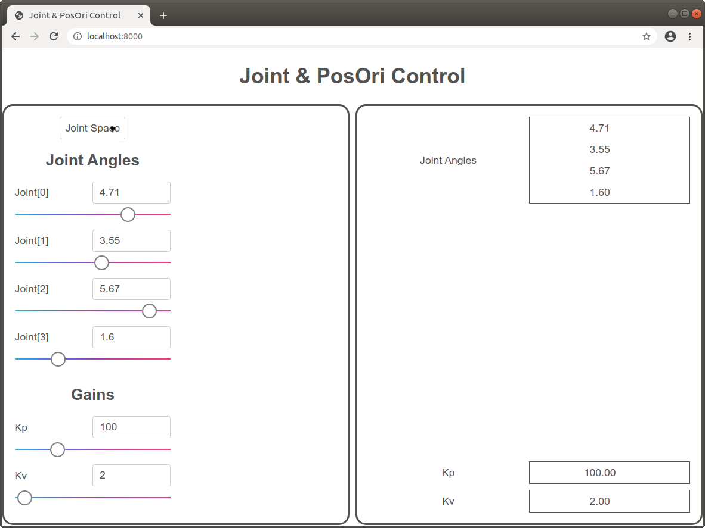
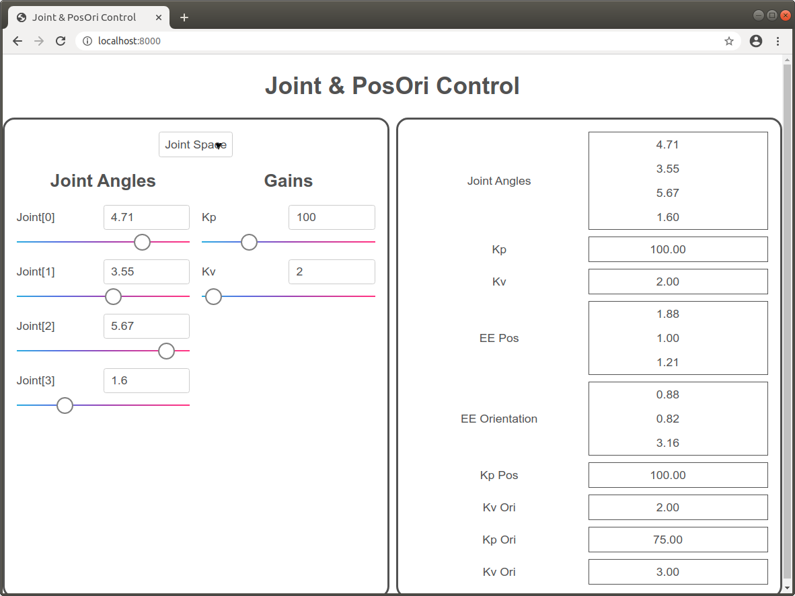
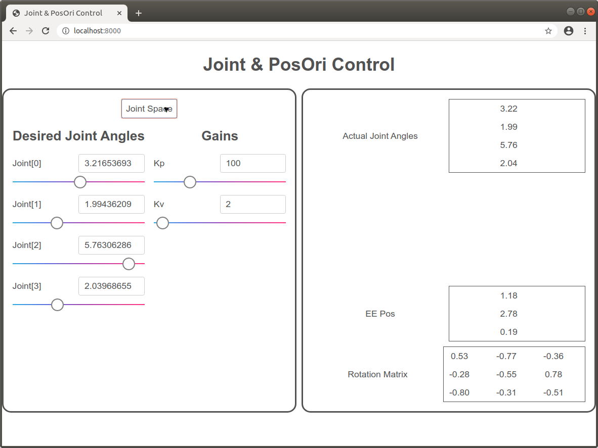
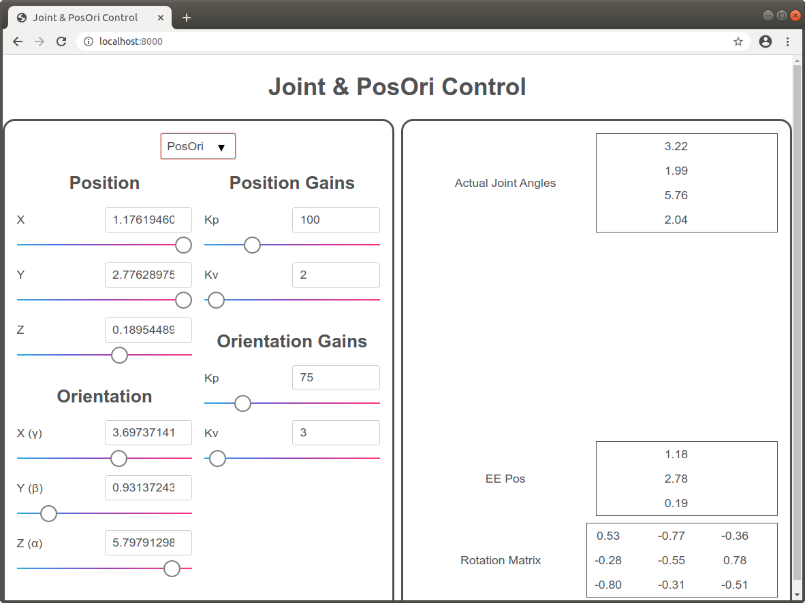

Joint Space & PosOri Control Tutorial
=====================================

In this tutorial, we will be improving the previous [joint space controller interface ](../01-joint/README.md) by adding end-effector position and orientation control. We will use `sai2-interfaces-select` to switch between the joint space interface and the position and orientation interface.

We define the same joint space keys:
* `sai2::interfaces::tutorial::q`: The robot joint angles - a vector.
* `sai2::interfaces::tutorial::joint_kp`: The position gain - a scalar.
* `sai2::interfaces::tutorial::joint_kv`: The velocity gain - a scalar.

We define new keys for position and orientation control:
* `sai2::interfaces::tutorial::ee_pos`: The desired end effector position
* `sai2::interfaces::tutorial::ee_ori`: The desired end effector orientation, in ZYX Euler angles.
* `sai2::interfaces::tutorial::ee_rotmat`: The end-effector rotation matrix from its default orientation.
* `sai2::interfaces::tutorial::ee_pos_kp`: The end-effector position proportional gain.
* `sai2::interfaces::tutorial::ee_pos_kv`: The end-effector position velocity gain.
* `sai2::interfaces::tutorial::ee_ori_kp`: The end-effector orientation proportional gain.
* `sai2::interfaces::tutorial::ee_ori_kv`: The end-effector orientation velocity gain.

We define a new key called `sai2::interfaces::tutorial::mode` that will tell us which mode (joint space control or posori) we are in. This key will have values `joint` or `posori`.

Use the provided [writekeys.py](./writekeys.py) script to initialize random
values for these Redis keys. You will need to specify how many links your robot
has.

For example, if your robot has 4 links, you can invoke the script as follows:
```
sai2::interfaces::tutorial::q set to b'[1.2465808008287347, 5.156711822562697, 3.2365011265875205, 0.81026085451469]'
sai2::interfaces::tutorial::joint_kp set to b'100'
sai2::interfaces::tutorial::joint_kv set to b'2'
sai2::interfaces::tutorial::ee_pos set to b'[1.8751580010081117, 0.9780837979691509, 1.211999613106625]'
sai2::interfaces::tutorial::ee_ori set to b'[0.8805654891772497, 0.8167378803441586, 3.1612632398808764]'
sai2::interfaces::tutorial::ee_pos_kp set to b'100'
sai2::interfaces::tutorial::ee_pos_kv set to b'2'
sai2::interfaces::tutorial::ee_ori_kp set to b'75'
sai2::interfaces::tutorial::ee_ori_kv set to b'3'

```

Like the previous tutorial, you should be able to see and drag sliders for each of these values. On the right side of the interface, you should see the Redis keys update. 

You should be able to use the top dropdown menu to switch between the joint space interface and the posori interface.

This tutorial assumes you understand everything from the [Joint Space Tutorial](../01-joint/README.md).

Just as a quick reference, remember that you can invoke the webserver as follows:
```
python3 interface/server.py YOUR_HTML_FILE_NAME_HERE
```


## Switching Between Modes
We will need the help of `sai2-interfaces-select` to switch modes. Let's wrap the current left container into a select element and see what happens:

```
<div class="container-item left-container center">
  <sai2-interfaces-select currentPrimitiveKey="sai2::interfaces::tutorial::mode">

    <!-- joint -->
    <sai2-interfaces-select-option name="Joint Space" key="joint">
      <div>
        <h2>Joint Angles</h2>
        <sai2-interfaces-slider 
          key="sai2::interfaces::tutorial::q"
          display="Joint"
          min="0" max="6.28" step="0.01">
        </sai2-interfaces-slider>
      </div>
      <div>
        <h2>Gains</h2>
        <sai2-interfaces-slider 
          key="sai2::interfaces::tutorial::joint_kp"
          display="Kp"
          min="0" max="400" step="0.01">
        </sai2-interfaces-slider>
        <sai2-interfaces-slider 
          key="sai2::interfaces::tutorial::joint_kv"
          display="Kv"
          min="0" max="100" step="0.01">
        </sai2-interfaces-slider>
      </div>
    </sai2-interfaces-select-option>

    <!-- posori -->
    <sai2-interfaces-select-option name="PosOri" key="posori">
    </sai2-interfaces-select-option>

  </sai2-interfaces-select>
</div>
```
_Note: The `key` parameter for the `sai2-interfaces-select-option` elements is the value that should be written to Redis. So they should be `joint` for joint and `posori` for PosOri._

Let's run it and see what we get:



That doesn't look right! The reason for this is that our `left-container` CSS class is split into two columns. Since our `sai2-interfaces-select` element is a child of the `div` that has the `left-container` class, the `sai2-interfaces-select` is shoved into one column instead of taking the entire column. 

What we really want is to have our `sai2-interfaces-select` element take up the entire left half of the screen, and then the `sai2-interfaces-select-option` _child_ that represents the joint or posori interface to be split into two columns.

To do this, we _remove_ the `left-container` class off the top level `div` and
add it to the `sai2-interfaces-select-option` children:
```
<div class="container-item center">
  <sai2-interfaces-select currentPrimitiveKey="sai2::interfaces::tutorial::mode">

    <!-- joint -->
    <sai2-interfaces-select-option name="Joint Space" key="joint" class="left-container">
      <div>
        <h2>Joint Angles</h2>
        <sai2-interfaces-slider 
          key="sai2::interfaces::tutorial::q"
          display="Joint"
          min="0" max="6.28" step="0.01">
        </sai2-interfaces-slider>
      </div>
      <div>
        <h2>Gains</h2>
        <sai2-interfaces-slider 
          key="sai2::interfaces::tutorial::joint_kp"
          display="Kp"
          min="0" max="400" step="0.01">
        </sai2-interfaces-slider>
        <sai2-interfaces-slider 
          key="sai2::interfaces::tutorial::joint_kv"
          display="Kv"
          min="0" max="100" step="0.01">
        </sai2-interfaces-slider>
      </div>
    </sai2-interfaces-select-option>

    <!-- posori -->
    <sai2-interfaces-select-option name="PosOri" key="posori" class="left-container">
    </sai2-interfaces-select-option>
  </sai2-interfaces-select>
</div>
```

Now this looks correct:




## Adding PosOri Sliders
Now that we have our blank container for the PosOri, let's add our sliders. Similar to the joint space interface, we're going to split this
into two columns: the left column will be our position and orientation sliders,
and the right column will be our position and orientation gains. 
```
<sai2-interfaces-select-option name="PosOri" key="posori" class="left-container">
  <div>
    <h2>Position</h2>
    <h2>Orientation</h2>
  </div>
  <div>
    <h2>Position Gains</h2>
    <h2>Orientation Gains</h2>
  </div>
</sai2-interfaces-select-option>
```

We have one key for the end effector position and another for orientation, so we need two sliders for the first column/div. We have a Kp and Kv for both position and orientation gains, so we have a total of four sliders for the second column.

Bringing this all together:
```
<sai2-interfaces-select-option name="PosOri" key="posori" class="left-container">
  <div>
    <h2>Position</h2>
    <sai2-interfaces-slider 
      key="sai2::interfaces::tutorial::ee_pos"
      display='["X","Y","Z"]'
      min="-1" max="1" step="0.01">
    </sai2-interfaces-slider>
    <h2>Orientation</h2>
    <sai2-interfaces-slider 
      key="sai2::interfaces::tutorial::ee_ori"
      display='["X (γ)", "Y (β)", "Z (α)"]'
      min="0" max="6.28" step="0.01">
    </sai2-interfaces-slider>
  </div>
  <div>
    <h2>Position Gains</h2>
    <sai2-interfaces-slider 
      key="sai2::interfaces::tutorial::ee_pos_kp"
      display="Kp"
      min="0" max="400" step="0.01">
    </sai2-interfaces-slider>
    <sai2-interfaces-slider 
      key="sai2::interfaces::tutorial::ee_pos_kv"
      display="Kv"
      min="0" max="100" step="0.01">
    </sai2-interfaces-slider>
    <h2>Orientation Gains</h2>
    <sai2-interfaces-slider 
      key="sai2::interfaces::tutorial::ee_ori_kp"
      display="Kp"
      min="0" max="400" step="0.01">
    </sai2-interfaces-slider>
    <sai2-interfaces-slider 
      key="sai2::interfaces::tutorial::ee_ori_kv"
      display="Kv"
      min="0" max="100" step="0.01">
    </sai2-interfaces-slider>
  </div>
</sai2-interfaces-select-option>
```

## Adding More Display Elements
We will display the current joint angles and EE position as well as the rotation
matrix of the EE orientation.
```
<div class="container-item right-container">
  <sai2-interfaces-display key="sai2::interfaces::tutorial::q" 
    refreshRate="1" display="Actual Joint Angles" decimalPlaces="2">
  </sai2-interfaces-display>

  <sai2-interfaces-display key="sai2::interfaces::tutorial::ee_pos" 
    refreshRate="1" display="Actual EE Pos" decimalPlaces="2">
  </sai2-interfaces-display>
  <sai2-interfaces-display key="sai2::interfaces::tutorial::ee_ori" 
    refreshRate="1" display="Rotation Matrix" decimalPlaces="2">
  </sai2-interfaces-display>
</div>
```


## The Finished Interface
See [02-joint-posori.html](./02-joint-posori.html) for the completed interface.

You can run the server as follows:
```
python3 interface/server.py tutorials/02-joint-posori/02-joint-posori.html
```

You should see something like this:



The interface will also remember which mode you were on last. If you were in PosOri last and then refresh the page, you should be on the PosOri page.
